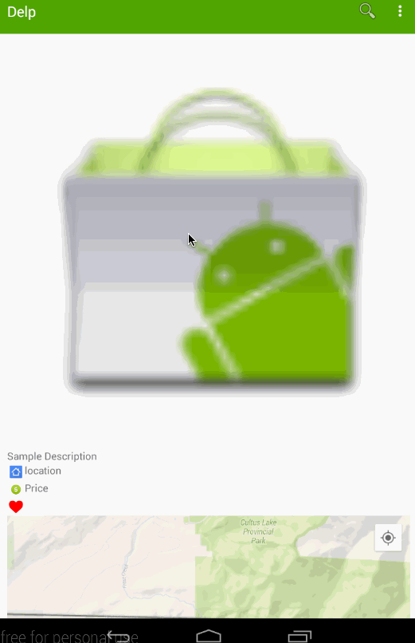

# Delp

## User Stories

### Milestone 1: Basic Requirements

#### Toolbar
- Drawer
    - Preference (use SharedPreferences)
    - My favorites (stored in DB)
    - My Merchant (with fake data)
- Search View - search deals

#### Home Activity
- Should show card view of deals
    - Item Adaptor
        - deal image
        - description
        - how far (location, where)
        - price
        - Yelp rating
        - a link to yelp

#### Click any deal goes to Detail Activity
- deal image
- description
- location (with Google Map)
- price 
- Yelp rating

### Milestone 2 - Optional

#### Home Activity
- Collapsible toolbar

#### Detail Activity
- top comments from Yelp (pick 2 or 3)

#### Yelp Link
- Webview (embedded page)

### Milestone 3 - Advanced

#### Detail Activity
- hand pick some deals with videos from the web (need a mock API)
- play the video run time

#### Fake backend API
- maps groupon deal ID ⇔ yelp business ID

#### Optional
- TBD

## Reference
- [layout](https://view.ziteboard.com/shared/UqplhH967NIMflh8J6M)

## Basic Functionality Demo

